# 🥗 NutriCore

*Where data becomes diet.*

> **🚀 Live app:** [nutricore-hybrid-diet-recommender.streamlit.app](https://nutricore-hybrid-diet-recommender.streamlit.app/)

NutriCore is a Streamlit meal-planning application built on the **Food.com** recipe and review
datasets. It calculates personalised nutrition targets, ranks recipes with a **hybrid scoring
engine** (nutrition fit + popularity + content similarity + collaborative filtering), lets users
refine every meal interactively, and persists ratings and blocked recipes in a local database.

> Built end-to-end from raw public data → preprocessing → model training → production app.
> ~303,000 recipes · ~789,000 reviews · ~170,000 users · 99.997% sparse interaction matrix.

---

## Table of Contents

1. [What is NutriCore](#1-what-is-nutricore)
2. [Screenshots](#2-screenshots)
3. [Key Features](#3-key-features)
4. [Tech Stack](#4-tech-stack)
5. [Repository Structure](#5-repository-structure)
6. [System Architecture](#6-system-architecture)
7. [Data Pipeline](#7-data-pipeline)
8. [The Hybrid Recommendation Pipeline](#8-the-hybrid-recommendation-pipeline)
9. [Nutrition Targeting Engine](#9-nutrition-targeting-engine)
10. [Application User Flow](#10-application-user-flow)
11. [Database Schema](#11-database-schema)
12. [Model Artifacts](#12-model-artifacts)
13. [Evaluation & Results](#13-evaluation--results)
14. [Notebook Index](#14-notebook-index)
15. [Getting Started](#15-getting-started)
16. [Demo Accounts](#16-demo-accounts)
17. [Known Limitations](#17-known-limitations)
18. [Data Attribution](#18-data-attribution)

---

## 1. What is NutriCore

NutriCore uses Kaggle's [Food.com - Recipes and Reviews](https://www.kaggle.com/datasets/irkaal/foodcom-recipes-and-reviews)
dataset: 522,517 recipes across 312 categories and 1,401,982 reviews from 271,907 users. It does
**not** tell you what to eat today. NutriCore turns those raw records into an actual daily meal plan:

| Stage | Input | Output |
|---|---|---|
| **Profile** | age, sex, weight, height, activity, diet, meals/day | BMR + TDEE |
| **Targets** | TDEE + goal (or manual entry) | daily Calories / Protein / Carbs / Fat |
| **Recommend** | per-meal macro budget | scored, diet-filtered recipe shortlist |
| **Plan** | user picks per meal | running remaining-budget tracking |
| **Finish** | completed plan | target-vs-actual macro summary |

The ranking is **not** a single model. It is a weighted blend of four signals, so a recipe only
surfaces to the top when it is *both* nutritionally appropriate for the current meal slot *and*
personally relevant to the user.

---

## 2. Screenshots

Captured from the live [application](https://nutricore-hybrid-diet-recommender.streamlit.app/) using demo account `1533`. Files live in [`assets/`](assets/).

| <h3 align="center">Login</h3> | <h3 align="center">Profile</h3> |
|:---:|:---:|
| 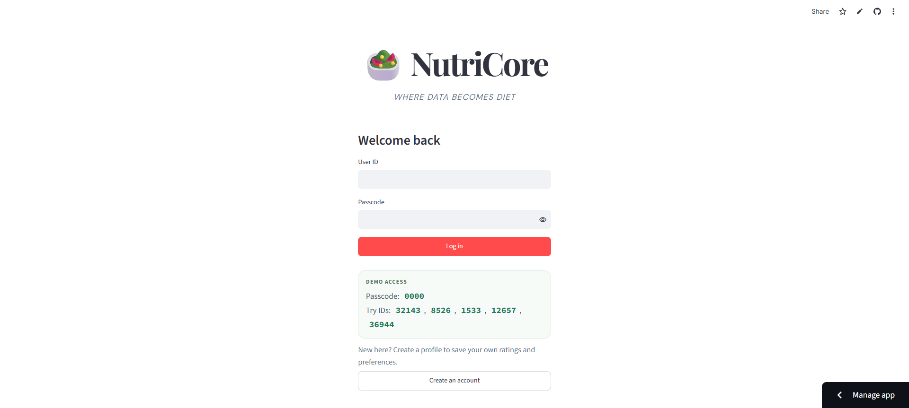 | 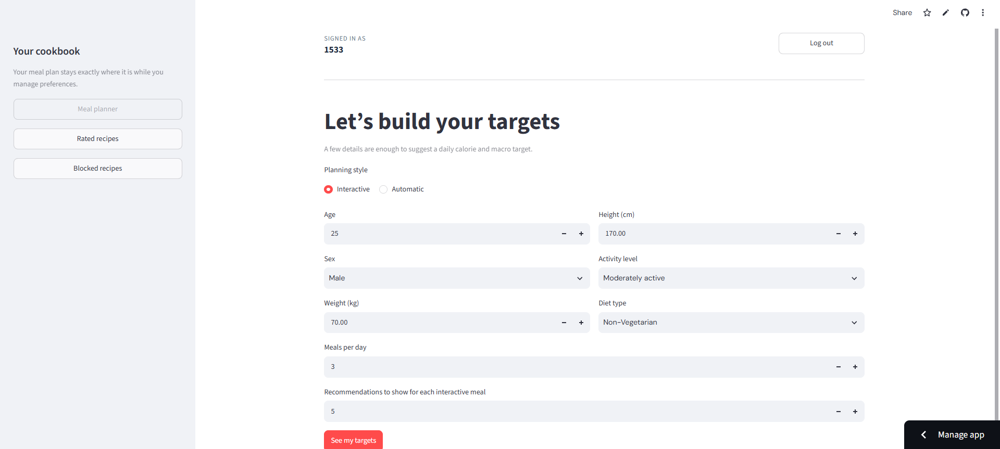 |

| <h3 align="center">Targets</h3> | <h3 align="center">Manual target entry</h3> |
|:---:|:---:|
| 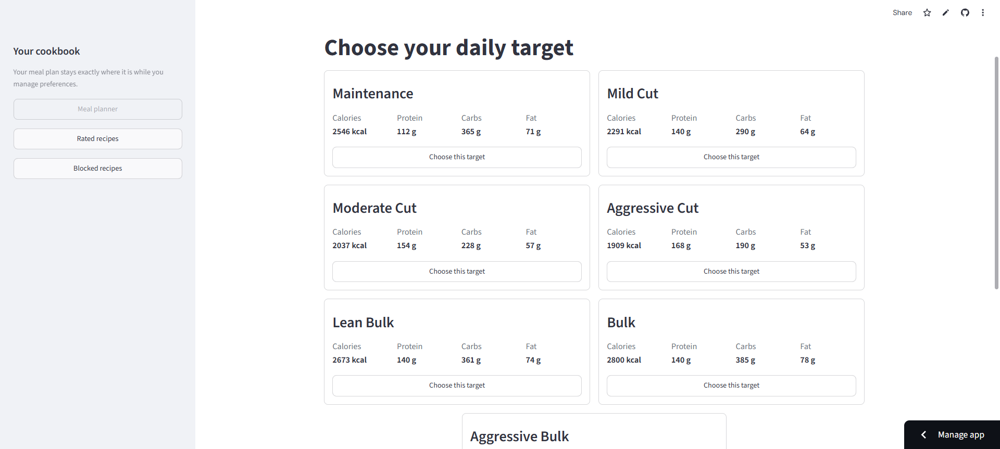 | 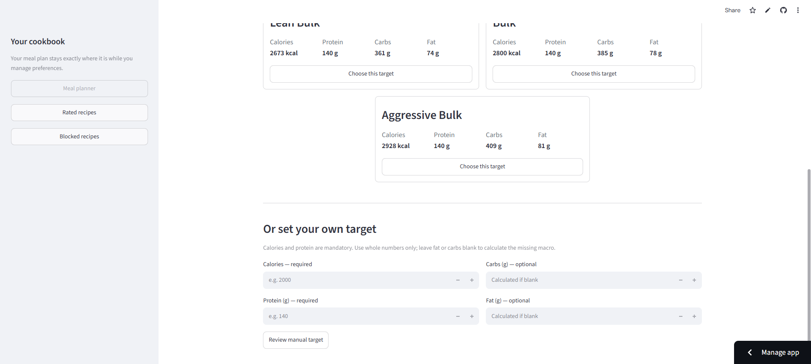 |

| <h3 align="center">Meal planner</h3> | <h3 align="center">Plan summary</h3> |
|:---:|:---:|
| 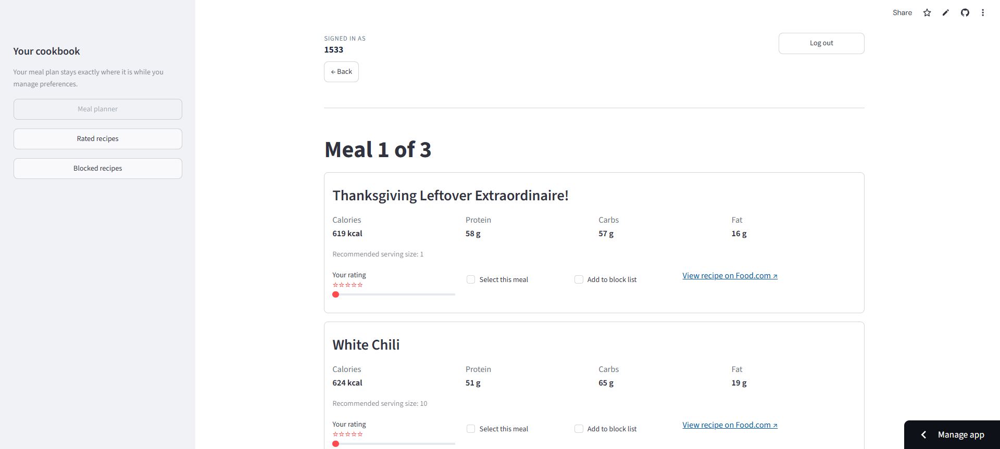 | 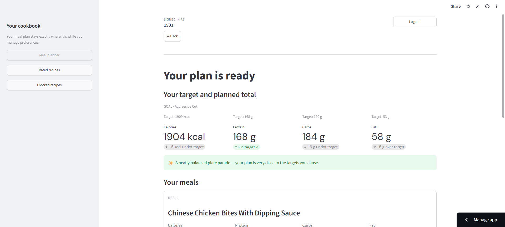 |

| <h3 align="center">Rated recipes</h3> | <h3 align="center">Blocked recipes</h3> |
|:---:|:---:|
| 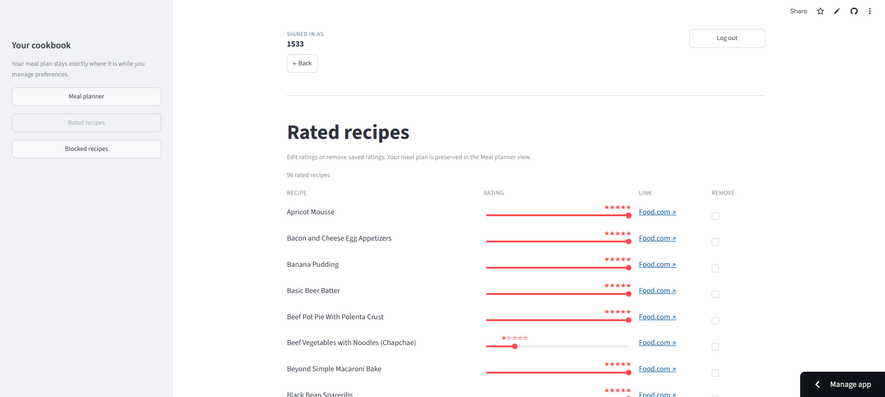 | 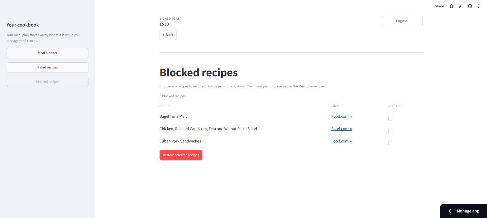 |

## 3. Key Features

**Nutrition science**
- BMR via the **Mifflin–St Jeor** equation, TDEE via 5 activity multipliers.
- 7 goal profiles (Maintenance → Aggressive Bulk) with goal-specific protein targets in g/kg.
- Manual target mode that back-fills missing macros, validates them (±50 kcal tolerance),
  and warns on unrealistic macro splits.

**Hybrid recommendation**
- Weighted **nutrition-distance** matching with **serving-size optimisation** per recipe.
- **TF-IDF + cosine similarity** content model over 50,000 features (uni + bigrams).
- **SVD matrix factorisation** (Surprise, 100 latent factors) for collaborative signal.
- **Bayesian weighted rating** popularity signal.
- 5-core cold-start filtering; deterministic, reproducible scores.

**Interactive planning**
- **Interactive mode** — 1–20 ranked cards per meal, rate / block / select.
- **Automatic mode** — the top-ranked meal is auto-selected, `top_n = 1`.
- Running remaining-budget tracking so every meal is re-scored against what is *left*.
- Back-navigation that undoes a meal and restores the later meals' recommendations.

**Persistence**
- SQLite (or any SQLAlchemy URL) with `users`, `reviews`, `blocked_recipes`.
- PBKDF2-HMAC-SHA256 passcode hashing (200,000 iterations, 16-byte salt).
- Ratings and block lists survive sessions and immediately feed the recommender.

---

## 4. Tech Stack

| Layer | Technology |
|---|---|
| UI | Streamlit 1.61.1 (custom CSS, `@st.fragment`, `@st.cache_resource`) |
| Data | pandas 2.2.3 · NumPy 1.26.4 · PyArrow 21.0.0 (Parquet) |
| ML | scikit-learn 1.4.2 (`TfidfVectorizer`, `linear_kernel`) |
| CF | scikit-surprise 1.1.5 (`SVD`) |
| Numerics | SciPy 1.12.0 (sparse CSR) |
| Serialization | joblib 1.4.2 |
| Database | SQLAlchemy 2.0.52 · SQLite (default) · `psycopg2-binary` for Postgres |
| Notebooks | Jupyter · Matplotlib |

---

## 5. Repository Structure

```
nutricore/
├── app.py                          # Streamlit entry point — session state machine + screens
├── setup_db.py                     # Optional: builds a fresh DB from processed reviews
├── requirements.txt
├── .streamlit/
│   └── config.toml                 # Light theme, headless server
├── .gitattributes                  # Git LFS tracks *.pkl, *.parquet, *.npz
│
├── data/
│   ├── raw/                        # Original Food.com extracts (unmodified)
│   │   ├── recipes.parquet           522,517 × 28
│   │   └── reviews.parquet         1,401,982 ×  8
│   └── processed/                  # Cleaned, model-ready datasets
│       ├── recipes_processed.parquet    302,965 × 16
│       ├── reviews_processed.parquet    788,843 ×  8
│       └── recipe_popularity.parquet    155,842 ×  5
│
├── models/                         # Trained, serialised artifacts
│   ├── svd_model.pkl                 Surprise SVD, 100 factors
│   ├── tfidf_vectorizer.pkl          Fitted TfidfVectorizer (50k features)
│   └── tfidf_matrix.npz              CSR matrix (302,965 × 50,000)
│
├── notebooks/                      # Research & experiments (executed, reproducible)
│   ├── 01_EDA_and_Preprocessing.ipynb
│   ├── 02_Review_Data_Preprocessing.ipynb
│   ├── 03_Nutrition_Target_Calculation.ipynb
│   ├── 04_Recipe_Recommendation_Engine.ipynb
│   ├── 05_Interactive_Meal_Planner.ipynb
│   ├── 06_Content_Based_Similarity_Engine.ipynb
│   ├── 07_Collaborative_Filtering.ipynb
│   ├── 08_Hybrid_Recommendation_System.ipynb
│   └── nb_utils/
│       ├── nutrition_nb.py         # Notebook workflow helpers; not imported by the app
│       └── recommender_nb.py       # Notebook workflow recommender; not imported by the app
│
├── src/                            # Production application modules
│   ├── __init__.py
│   ├── data_loader.py              # Cached dataset + artifact loading
│   ├── database.py                 # Engine, schema, auth, ratings, block list
│   ├── nutrition.py                # BMR/TDEE, macro targets, validation, eligibility
│   ├── recommender.py              # Hybrid scoring engine
│   ├── ui.py                       # Reusable Streamlit presentation components
│   └── utils.py                    # Small framework-independent helpers
│
└── nutricore.db                    # Pre-seeded SQLite demo database (~80 MB)
```

`src/nutrition.py` and `src/recommender.py` are the production modules used by `app.py`.
`notebooks/nb_utils/nutrition_nb.py` and `notebooks/nb_utils/recommender_nb.py` support the
notebook workflow only; they are not imported by the application.

`src/ui.py` holds all Streamlit presentation; `app.py` holds the workflow and session state.
The two are deliberately separate so the planner logic is testable without a UI.

---

## 6. System Architecture

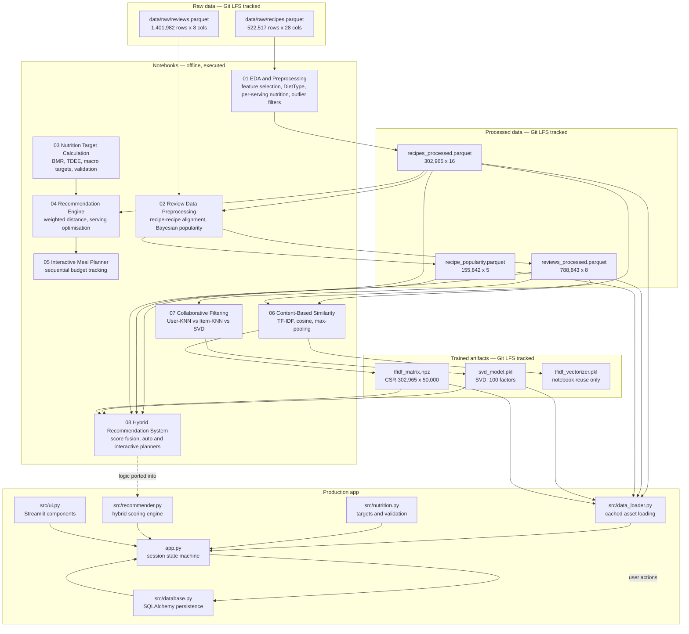

---

## 7. Data Pipeline

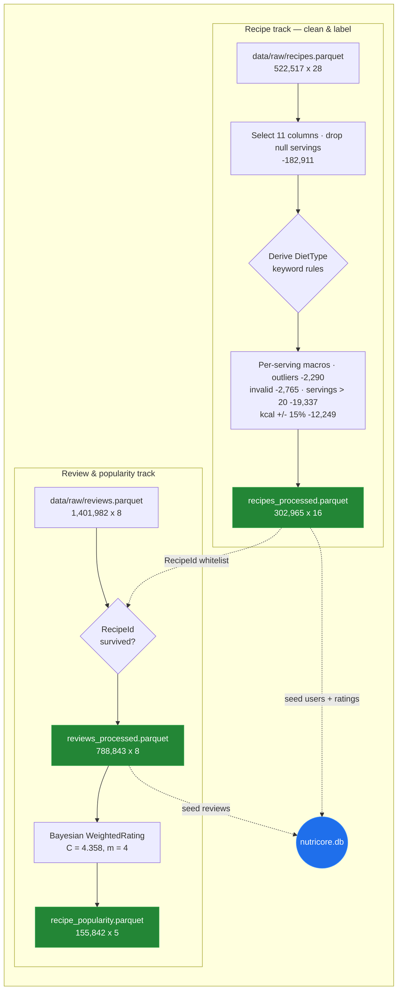

### 7.1 Recipe cleaning funnel

| Step | Rule | Rows removed | Rows remaining |
|---|---|---:|---:|
| Raw recipes | — | — | 522,517 |
| Column selection | Keep 11 of 28 columns | — | 522,517 |
| Missing servings | `RecipeServings` is null | 182,911 | 339,606 |
| Nutrition outliers | kcal ≤ 2000, protein ≤ 100 g, carbs ≤ 200 g, fat ≤ 100 g | 2,290 | 337,316 |
| Invalid nutrition | `Calories <= 0` or all macros ≤ 0 | 2,765 | 334,551 |
| Unrealistic servings | `RecipeServings > 20` | 19,337 | 315,214 |
| Calorie consistency | `\|Calories − (4P + 4C + 9F)\| / derived ≤ 15%` | 12,249 | **302,965** |

### 7.2 Diet classification

The Food.com extract has **no diet label**, so it is derived by keyword matching over
lowercased `Name` + `RecipeIngredientParts`:

1. Strip ~58 `VEG_EXCEPTIONS` terms (eggplant, vegan bacon, seitan, tempeh, mock meat, …) so
   plant-based substitutes are not misread as animal products.
2. Any `NON_VEG_KEYWORDS` substring (poultry, beef, pork, lamb/goat, ~45 seafood terms) → `Non-Vegetarian`.
3. Else any `EGG_KEYWORDS` (`egg`, `eggs`, `omelet`, `omelette`, `frittata`, `quiche`) → `Eggitarian`.
4. Else → `Vegetarian`.

| Diet filter | Recipes | Share of catalogue |
|---|---:|---:|
| `Vegetarian` | 114,089 | 37.7% |
| `Eggitarian` (Vegetarian **+** Eggitarian) | 160,847 | 53.1% |
| `Non-Vegetarian` (no filter applied) | 302,965 | 100% |

> ~142,000 recipes (47%) are unavailable to vegetarian and eggitarian users. This is a genuine
> coverage gap — see [Known Limitations](#17-known-limitations).

### 7.3 Review cleaning and popularity

Reviews are filtered so that **every remaining review points at a recipe the app can actually
recommend**. 43.73% of raw reviews referenced recipes removed by the recipe cleaner and are dropped.

The raw review data has **zero nulls and zero duplicates**; 71.7% of ratings are exactly 5, so raw
averages are not trustworthy on their own. NutriCore uses a Bayesian weighted rating:

```
WR  =  (v / (v + m)) x R  +  (m / (v + m)) x C

C  =  4.358   (global mean average rating)
m  =  4       (75th percentile of review count per recipe)

PopularityScore = WR / 5          -> bounded [0, 1], no min-max exaggeration
```

---

## 8. The Hybrid Recommendation Pipeline

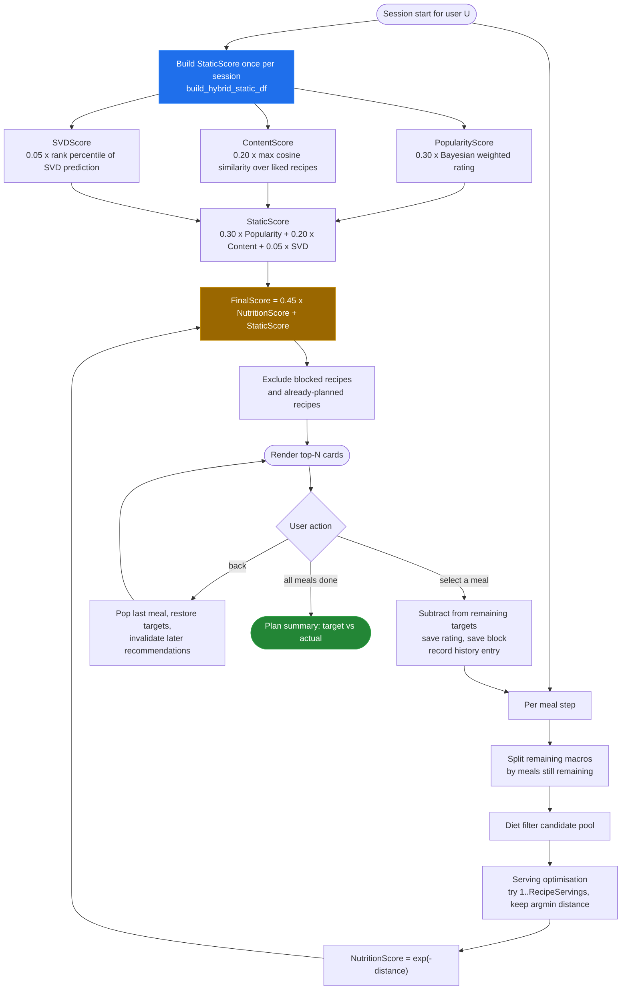

### 8.1 Nutrition distance (per-meal, per-serving)

```
meal_target_X = remaining_X / meals_still_remaining

Diff_X = | actual_X - meal_target_X | / meal_target_X        (relative, so units are comparable)

distance = 0.30 * Diff_Calories
         + 0.40 * Diff_Protein
         + 0.15 * Diff_Carbs
         + 0.15 * Diff_Fat

NutritionScore = exp(-distance)          -> bounded (0, 1]; 0 distance = 1.0
```

Protein carries the **highest weight (0.40)** because it is the most important macro for the
fitness-oriented goals the goal profiles target.

### 8.2 Serving-size optimisation

For every candidate recipe the engine evaluates **every whole-number serving from 1 to
`RecipeServings`** and keeps the one with the lowest distance. The cap is deliberate — it stops a
low-calorie recipe from matching a large meal slot through an unrealistic portion.

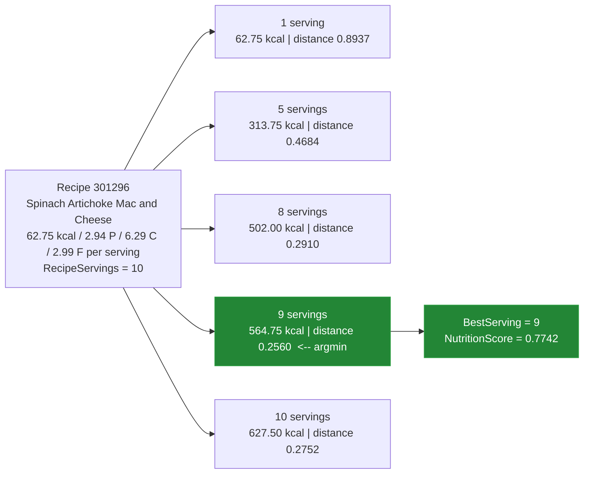

### 8.3 Static preference signals

| Signal | Weight | Definition |
|---|---:|---|
| `PopularityScore` | **0.30** | `WeightedRating / 5`, Bayesian. Missing values filled with the **mean** (high weight → neutral baseline, not a punitive zero). |
| `ContentScore` | **0.20** | `max` cosine similarity between a recipe's TF-IDF vector and the vectors of the user's **liked** recipes (rating ≥ 4). Self-similarity zeroed. Missing → 0. |
| `SVDScore` | **0.05** | Rank percentile (`rank(pct=True)`) of the raw Surprise SVD prediction (`clip=False`). Missing → 0. Deliberately the smallest weight — it is the noisiest signal and the most likely to be absent for cold-start users. |

```
StaticScore = 0.30 * PopularityScore + 0.20 * ContentScore + 0.05 * SVDScore
FinalScore  = 0.45 * NutritionScore + StaticScore
```

The four coefficients sum to **1.00**, and nutrition alone (0.45) outweighs the entire static
block (0.55) in practice because `NutritionScore` is a tight distribution around 0.9–1.0 for
good matches while `StaticScore` rarely exceeds 0.5.

**Design intent:** a recipe that matches the user's macros perfectly should always beat a globally
popular recipe that does not. Personalisation tunes the ranking *within* the nutritionally viable set.

### 8.4 Content model detail

| Setting | Value |
|---|---|
| Source columns | `Name`, `Description`, `RecipeCategory`, `Keywords`, `RecipeIngredientParts`, `DietType` |
| Feature repetition | Name **x3**, Ingredients **x3**, Keywords **x2**, Description x1, Category x1, DietType x1 |
| Boilerplate removed | `make and share this`, `recipe from food com`, `recipe from food`, `food com`, `food`, `com` |
| Vectorizer | `TfidfVectorizer(stop_words="english", max_features=50000, ngram_range=(1, 2))` |
| Matrix | CSR, `(302,965, 50,000)` |
| Similarity | `linear_kernel` (equals cosine on L2-normalised rows) |
| Aggregation across liked recipes | `max(axis=0)` — best match wins, prevents dilution across diverse tastes |

A full 302,965 x 302,965 similarity matrix is never materialised; similarity is computed on demand
against a single row.

### 8.5 Collaborative filtering detail

| Item | Value |
|---|---|
| Interaction matrix (raw) | 170,039 users x 155,842 recipes — **99.997% sparse** (density 0.002977%) |
| Cold-start users (< 5 ratings) | 152,458 (89.66%) |
| Cold-start recipes (< 5 ratings) | 118,968 (76.34%) |
| After 5-core filtering | 17,546 users x 36,632 recipes, 420,570 ratings — **99.9346% sparse** |
| Candidates benchmarked | User-KNN, Item-KNN, SVD |
| **Winner** | **SVD** (latent factors generalise across a near-empty neighbourhood) |
| SVD config | `SVD(n_factors=100, n_epochs=20, lr_all=0.005, reg_all=0.02, random_state=42)` |
| Split | `train_test_split(test_size=0.2, random_state=42)` → 84,114 test ratings |

---

## 9. Nutrition Targeting Engine

### 9.1 BMR and TDEE

```
BMR (male)    = (10 x weight_kg) + (6.25 x height_cm) - (5 x age) + 5
BMR (female)  = (10 x weight_kg) + (6.25 x height_cm) - (5 x age) - 161
```

| Activity level | Multiplier |
|---|---:|
| Sedentary | 1.200 |
| Lightly active | 1.375 |
| Moderately active | 1.550 |
| Very active | 1.725 |
| Athlete | 1.900 |

### 9.2 Goal profiles

Calorie targets are **percentage-based**, not fixed, so they scale across body sizes.

| Goal | TDEE multiplier | Protein (g/kg) |
|---|---:|---:|
| Maintenance | 1.00 | 1.6 |
| Mild Cut | 0.90 | 2.0 |
| Moderate Cut | 0.80 | 2.2 |
| Aggressive Cut | 0.75 | 2.4 |
| Lean Bulk | 1.05 | 2.0 |
| Bulk | 1.10 | 2.0 |
| Aggressive Bulk | 1.15 | 2.0 |

```
Protein = weight_kg x goal_factor
Fat     = (calories x 0.25) / 9                 # fixed 25% of calories, midpoint of the 20-35% band
Carbs   = (calories - protein x 4 - fat x 9) / 4   # residual macro
```

*Worked example — 75 kg male, 175 cm, age 25, moderately active (TDEE 2,672 kcal):*

| Goal | Calories | Protein | Fat | Carbs |
|---|---:|---:|---:|---:|
| Maintenance | 2672 | 120.0 g | 74.2 g | 381.0 g |
| Mild Cut | 2405 | 150.0 g | 66.8 g | 301.0 g |
| Moderate Cut | 2137 | 165.0 g | 59.4 g | 235.6 g |
| Aggressive Cut | 2004 | 180.0 g | 55.7 g | 195.7 g |
| Lean Bulk | 2805 | 150.0 g | 77.9 g | 376.0 g |
| Bulk | 2939 | 150.0 g | 81.6 g | 401.1 g |
| Aggressive Bulk | 3073 | 150.0 g | 85.4 g | 426.1 g |

### 9.3 Manual target mode

Calories and protein are mandatory. Missing macros are back-filled, supplied values are preserved:

| Provided | Computed |
|---|---|
| Calories + Protein only | `Fat = calories x 0.25 / 9`, then `Carbs = residual` |
| Calories + Protein + Fat | `Carbs = residual` |
| Calories + Protein + Carbs | `Fat = (calories - 4P - 4C) / 9` |
| All four | Passed straight through to validation |

### 9.4 Three guard layers

| Layer | Purpose | Thresholds |
|---|---|---|
| `validate_macros` | Arithmetic agreement | `\|calories − (4P + 9F + 4C)\| ≤ 50 kcal` |
| `assess_macro_quality` | Advisory warnings | Protein `<15%` or `>40%`; Fat `<20%` or `>35%`; Carbs `<20%` |
| `check_recommendation_eligibility` | Hard gate | Protein `<10%`; Fat `<10%`; Carbs `<5%` of calories |

**Key insight:** *nutritional validity* ≠ *recommendation quality*. A macro split can be
arithmetically perfect and still be unrepresentable in the Food.com catalogue. The three layers
keep the user informed without ever silently blocking them — only `eligibility` disables the
"use these targets" button.

> These thresholds are general guidance, **not medical advice**.

---

## 10. Application User Flow

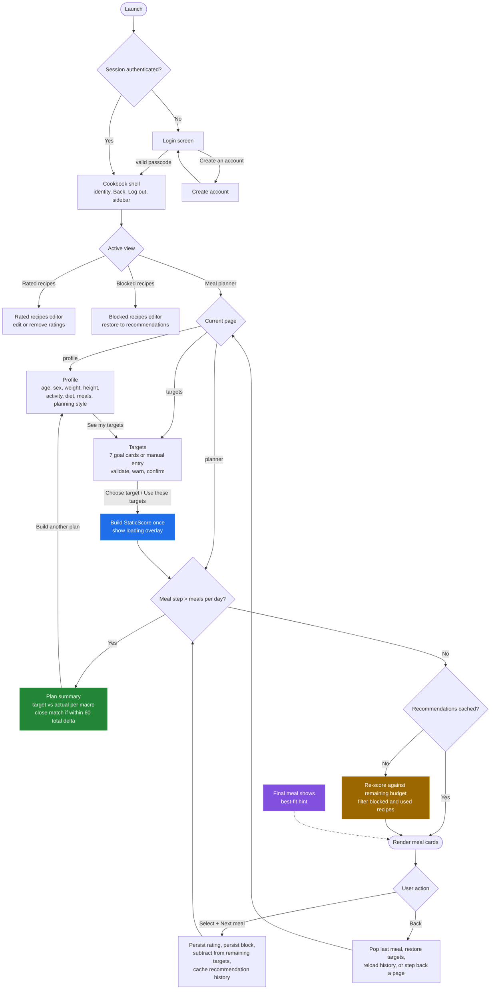

### 10.1 Session state

| Key | Purpose |
|---|---|
| `page` | `profile` → `targets` → `planner` |
| `profile` | `{weight, tdee}` captured at the profile step |
| `targets` / `remaining_targets` | Full daily target, and the running remaining budget |
| `meal_step` / `meal_count` | 1-based progress through the day |
| `meal_plan` | List of selected recipe rows |
| `meal_recommendations` | Cached recommendations for the current step |
| `meal_history` | `{step: {recommendations, selected_id}}` — powers back-navigation |
| `hybrid_static_df` | Per-session static scores, computed once |
| `planner_mode` | `Interactive` (N cards) or `Automatic` (top-1) |
| `recommendation_count` | Cards shown per meal in Interactive mode (1–20) |
| `revisiting_meal_step` / `restore_selected_step` | Back-navigation UI state |
| `invalidated_recipe_ids` | IDs whose widget keys must be cleared after a re-render |
| `is_generating_recommendations` | Disables navigation while the overlay is up |

### 10.2 Back-navigation behaviour

Going back from a meal pops the selection, **adds its macros back** to `remaining_targets`,
restores that step's cached recommendations, and preselects the previous choice. If the user picks
a *different* recipe at that step, `invalidate_later_meals()` discards every later step's
recommendations (and force-clears their widget keys) while **keeping the later recipes already
chosen** — so a swap only refreshes what depends on it.

---

## 11. Database Schema

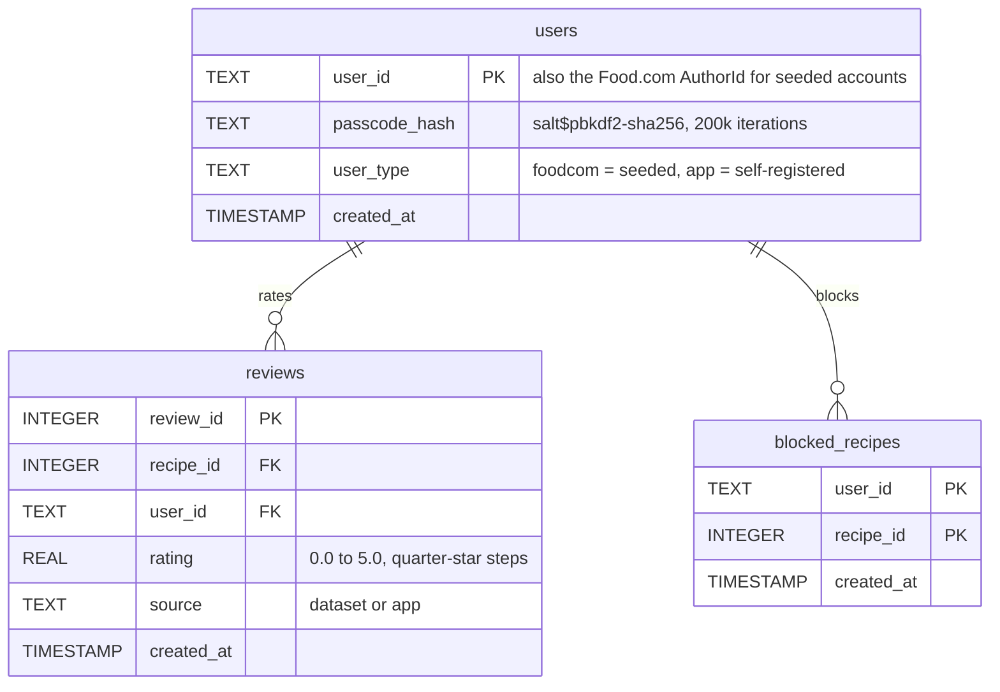

`reviews` carries a `UNIQUE(user_id, recipe_id)` constraint, so writes are idempotent
`INSERT ... ON CONFLICT DO UPDATE` upserts.

`nutricore.db` is committed intentionally so the demo accounts work immediately. It contains
seeded Food.com users and their ratings (`user_type = 'foodcom'`, `source = 'dataset'`); anything
created in the app gets `user_type = 'app'`, `source = 'app'`.

---

## 12. Model Artifacts

| File | Size | Produced by | Loaded by |
|---|---:|---|---|
| `models/svd_model.pkl` | 51.3 MB | Notebook 07 | `src/data_loader.py` |
| `models/tfidf_matrix.npz` | 169.6 MB | Notebook 06 | `src/data_loader.py` |
| `models/tfidf_vectorizer.pkl` | 31.9 MB | Notebook 06 | **Notebooks only** — the app reads the pre-built matrix |
| `data/processed/recipes_processed.parquet` | 48.6 MB | Notebook 01 | App, notebooks, `setup_db.py` |
| `data/processed/reviews_processed.parquet` | 148.9 MB | Notebook 02 | App, notebooks, `setup_db.py` |
| `data/processed/recipe_popularity.parquet` | 1.7 MB | Notebook 02 | App, notebooks |
| `data/raw/recipes.parquet` | 170.4 MB | Food.com source | Notebooks 01+ |
| `data/raw/reviews.parquet` | 165.7 MB | Food.com source | Notebook 02+ |
| `nutricore.db` | 79.9 MB | `setup_db.py` | App |

---

## 13. Evaluation & Results

### 13.1 Collaborative filtering

| Metric | SVD (selected) |
|---|---:|
| **RMSE** | **0.9031** |
| **MAE** | **0.5237** |

Benchmarked against user-based KNN (`n_neighbors=50`, significance `k=10`) and item-based KNN
(`n_neighbors=20`, `max_source_recipes=50`). SVD was selected because at 99.93% post-filter
sparsity, neighbourhood overlap is almost nonexistent; 100 latent factors generalise across
unobserved user-item pairs.

### 13.2 Meal-plan macro adherence

Target: 2,181 kcal / 169.4 g protein / 239.5 g carbs / 60.6 g fat, 4 meals, Non-Vegetarian.

| Planner | kcal remaining | protein | carbs | fat | kcal deviation |
|---|---:|---:|---:|---:|---:|
| Automatic (greedy top-1) | −49.0 | −0.5 g | −10.9 g | +0.4 g | 2.2% |
| Interactive (user picked) | −4.3 | +1.6 g | −1.1 g | −1.2 g | **0.2%** |

A tight hit is possible because the last meal is served against whatever budget remains, and each
recipe's serving count is optimised independently before ranking.

### 13.3 Nutrition engine

| Check | Result |
|---|---|
| Best single-meal distance (notebook 04) | 0.1480 → `NutritionScore` 0.8625 |
| Nutrition-only planner residual (notebook 05) | −3.15 kcal, +0.80 g P, −0.28 g C, −0.55 g F |
| TF-IDF self-similarity sanity check | max 1.0000, min 0.0000 across 302,965 scores |
| `exp(−distance)` transform check | `exp(−0.7627) = 0.4664` ✓ |
| Engine throughput (1,000-recipe sample) | 0.55 s |
| Cross-notebook determinism | `StaticScore` 0.474739 and `FinalScore` 0.815019 reproduced bit-identically |

## 14. Notebook Index

| # | Notebook | Answers | Writes |
|---|---|---|---|
| 01 | EDA and Preprocessing | Which columns matter, how to derive diet labels, how to get per-serving nutrition, how to clean outliers | `recipes_processed.parquet` |
| 02 | Review Data Preprocessing | Review quality, recipe-review alignment, rating bias, activity distribution, popularity feature | `reviews_processed.parquet`, `recipe_popularity.parquet` |
| 03 | Nutrition Target Calculation | What should this person eat today? | — (pure functions) |
| 04 | Recipe Recommendation Engine | Which single recipe best matches one meal? | — |
| 05 | Interactive Meal Planner | How do we assemble a whole day sequentially? | — |
| 06 | Content-Based Similarity Engine | Which recipes are semantically similar / which match my taste? | `tfidf_vectorizer.pkl`, `tfidf_matrix.npz` |
| 07 | Collaborative Filtering | KNN or matrix factorisation, given extreme sparsity? | `svd_model.pkl` |
| 08 | Hybrid Recommendation System | How do the signals combine into one ranking? | — |

All notebooks share a bootstrap cell that walks up to the folder containing `data/`, adds
`notebooks/` to `sys.path`, and `chdir`s to the project root — so they run from any working directory.

---

## 15. Getting Started

**Fastest way to try it:** open the hosted demo at
[nutricore-hybrid-diet-recommender.streamlit.app](https://nutricore-hybrid-diet-recommender.streamlit.app/)
and log in with passcode `0000` and any demo ID from the login screen (`32143`, `8526`, `1533`,
`12657`, `36944`). To run it yourself, continue below.
**Prerequisites:** Python 3.11+ (developed on 3.12), Git, and Git LFS.

```bash
# 1. Clone (with LFS so the 800 MB of artifacts come down correctly)
git lfs install
git clone <your-repo-url>
cd nutricore-hybrid-diet-recommender

# 2. Virtual environment
python -m venv .venv
source .venv/bin/activate        # Windows: .venv\Scripts\activate

# 3. Dependencies
pip install -r requirements.txt

# 4. Run
streamlit run app.py
```

The app opens at `http://localhost:8501`. All datasets and model artifacts are committed, so no
training step is required to run it.

### Rebuilding the database from scratch

Only needed if you want to drop the demo accounts and seed purely from the processed reviews:

```bash
python setup_db.py
```

This reads `data/processed/reviews_processed.parquet`, creates the three tables, and inserts every
unique `AuthorId` as a user with passcode `0000` and `user_type = 'foodcom'`, plus all their
ratings with `source = 'dataset'`.

### Re-running the notebooks

Notebooks 01–08 are **already executed** with all outputs saved, so they can be read without
running anything. To re-run from scratch, execute in numerical order — 06 and 07 must finish before
08, and 01–02 must finish before 06/07. Note that notebook 02 depends on the output of 01.

---

## 16. Demo Accounts

The repository ships a pre-seeded database so the app is usable immediately.

| | |
|---|---|
| **Passcode** | `0000` (all demo accounts) |
| **User IDs** | `32143`, `8526`, `1533`, `12657`, `36944` |

These IDs are real Food.com `AuthorId` values with real historical ratings, which is what makes
the content and collaborative signals produce meaningful results out of the box.

You can also register a new account from the login screen. New accounts have no historical reviews,
so `ContentScore` falls back to 0 and only the nutrition and popularity signals are active — a
genuine cold-start path.

---

## 17. Known Limitations

| Area | Issue |
|---|---|
| **Diet coverage** | ~47% of the catalogue is unavailable to vegetarian/eggitarian users. The `Non-Vegetarian` filter applies **no filter at all**, so non-vegetarians can be shown egg/vegetarian recipes — this is intentional (superset behaviour) but asymmetric. |
| **Cold-start users** | Self-registered accounts have no reviews, so `ContentScore = 0` and `SVDScore = 0`. Recommendations are nutrition + popularity only until the user rates a few meals. |
| **Extreme sparsity** | 99.9346% sparse after 5-core filtering. The SVD weight is deliberately kept at 0.05 because the signal is weak. |

---

## 18. Data Attribution

This project uses the [Food.com - Recipes and Reviews](https://www.kaggle.com/datasets/irkaal/foodcom-recipes-and-reviews)
dataset hosted on Kaggle. The source provides recipe and review records in Parquet and CSV formats;
this project uses the Parquet files. The Kaggle listing designates the dataset **CC0: Public Domain**.

- Recipe titles, nutrition, ingredients, instructions, and reviews originate from Food.com and its contributors.
- The bundled `nutricore.db` contains Food.com author IDs and their historical ratings from the dataset.
- NutriCore is an educational project. **Nothing here is medical or dietary advice.**